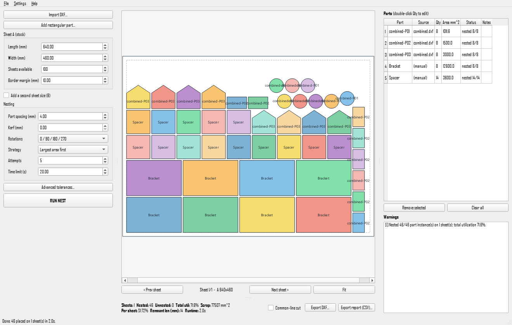

# CAD-N

An open-source **2D true-shape nesting** tool for arranging DXF part profiles onto
rectangular sheet stock, with a clean DXF export for downstream laser / plasma /
router / CNC workflows.

Built using only open-source libraries
(**ezdxf, Shapely, PySide6, numpy**) and public nesting techniques.

> Status: **v0.4.0 — first public release.** It loads DXFs, detects parts, nests
> them without overlap (including across two stock sizes), reports utilization,
> and exports a clean DXF with optional common-line cutting. Part-in-part,
> non-rectangular sheets and NFP optimization are *future* work.



*46 parts (imported DXF shapes + manual rectangles) nested on a single sheet at
71.6% utilization — regenerate this screenshot any time with
`python tools/screenshot_gui.py`.*

---

## What it does

- **Import DXF** (one or many, or a combined DXF with many parts).
- Show a **layer/entity summary** and let you choose which layers are cut geometry.
- Convert `LINE / LWPOLYLINE / POLYLINE / ARC / CIRCLE / SPLINE / ELLIPSE` and
  exploded `INSERT` blocks into clean closed polygons.
- **Ignore annotation** (`TEXT / MTEXT / DIMENSION / LEADER / MLEADER / HATCH …`)
  by default — dimension arrows never become cut parts.
- Detect **holes** and **multiple parts**; group identical repeats by quantity.
- **Add manual rectangular parts** (length × width × qty).
- **Nest** with spacing + kerf, rotation, multiple sheets, multi-seed search.
- **Two stock sizes**: optionally define a Sheet B; the engine searches A/B mixes
  and returns the configuration with the least total stock area, with ranked
  alternatives to choose from.
- **Preview** each sheet (zoom / pan), with utilization, scrap and remnant length.
- **Export a clean nested DXF** (layers `SHEET_BOUNDARY` / `CUT` / `LABELS`),
  gated by a validation step that refuses to write overlapping / out-of-bounds geometry.
- **Common-line cutting** (opt-in): butting parts are dissolved so shared edges are
  cut once (`COMMON_CUT` layer) instead of as doubled coincident lines.
- **Save / load jobs** (self-contained JSON — survives moved source files).
- **CSV report** of the job.
- Packaged as a **Windows `.exe`** (PyInstaller) with an optional Inno Setup installer.

## Quick start (from source)

```bat
python -m venv .venv
.venv\Scripts\activate
pip install -r requirements.txt
python -m cad_n
```

Tested on **Python 3.11–3.14** (developed on 3.14). All dependencies install as
binary wheels.

## Run the tests

```bat
pip install -r requirements-dev.txt
pytest                          # 65 tests
python tools/make_fixtures.py   # write sample DXFs
python tools/fetch_real_dxf.py  # download real-world DXFs (optional, needs internet)
python tools/benchmark.py       # full-pipeline benchmark over every DXF
python tools/render.py          # visual gallery PNGs -> tests/_visual_out/
```

## Build the Windows .exe

```bat
pip install -r requirements-dev.txt
python tools/make_icon.py
pyinstaller build\cad_n.spec --noconfirm        REM one-folder build -> dist\CAD-N\
set CADN_ONEFILE=1 & pyinstaller build\cad_n.spec --noconfirm   REM single-file
```

See **build_notes.md** for packaging details and troubleshooting, and
**USER_GUIDE.md** for the operator workflow.

## Project layout

```
cad_n/
  config.py            tolerance policy + app constants
  logging_setup.py     rotating dev log (operator warnings are separate)
  main.py / __main__.py entry point (python -m cad_n)
  core/
    models.py          Part, Sheet, NestingSettings, Placement, NestingResult, Notice
    units.py           DXF $INSUNITS -> mm
    geometry_cleaner.py weld / stitch / DCEL faces / containment / repair
    dxf_importer.py    ezdxf read, layer filter, flatten, explode, warnings
    nesting_engine.py  multi-seed orchestration + scoring + report metrics
    placement.py       bottom-left-fill packing with clearance + rotations
    dxf_exporter.py    clean DXF out + pre-export validation gate
    reports.py         CSV + summary
    job_io.py          self-contained JSON jobs
  ui/                  PySide6: main_window, preview_canvas, import/settings dialogs, worker
tests/                 65 tests + dxfgen fixture builders + downloaded real DXFs
tools/                 make_fixtures / fetch_real_dxf / benchmark / render / make_icon / screenshot
build/                 PyInstaller spec, version resource, launcher, Inno Setup script
```

## Design notes

- **DXF truth first.** The importer decides what is cut geometry vs annotation
  *before* anything is nested, and reconstructs closed loops from loose segments
  (point welding → leaf pruning → simple-cycle / DCEL planar faces → even-odd
  containment for holes).
- **Correctness over optimization.** Every placement is checked for no-overlap
  and inside-sheet; clearance = spacing + kerf is enforced by offsetting a
  candidate and testing against placed originals. The engine never emits an
  invalid layout, and the exporter re-validates before writing.
- **Fail safe, talk plainly.** Operator-facing notices are plain English; full
  stack traces go to the dev log only. A malformed DXF produces a clean message,
  never a crash (verified against real broken files from the internet).

## Limitations (honest)

- Greedy bottom-left-fill, not a commercial-grade optimizer. Good, not optimal.
- No part-in-part nesting, non-rectangular sheets, or NFP optimization yet.
- Large jobs (hundreds of parts) take seconds per attempt; the time limit caps it.
- Not every exotic DXF entity is supported; unsupported entities are reported, not guessed.

## License

CAD-N is released under the **MIT License** — see [`LICENSE`](LICENSE). You may
use, modify, and redistribute it (including commercially) provided the copyright
notice is retained.

Third-party components keep their own licenses — ezdxf (MIT), NumPy (BSD-3-Clause),
Shapely (BSD-3-Clause), GEOS (LGPL-2.1) and PySide6/Qt (LGPL-3.0). The full inventory
and license texts are in [`THIRD_PARTY_LICENSES.md`](THIRD_PARTY_LICENSES.md),
[`NOTICE`](NOTICE), and the [`LICENSES/`](LICENSES/) folder.

## Acknowledgments

CAD-N stands on excellent open-source work:

- **[ezdxf](https://github.com/mozman/ezdxf)** (Manfred Moitzi) — does the heavy lifting
  of reading and writing DXF.
- **[Shapely](https://github.com/shapely/shapely)** / **[GEOS](https://libgeos.org/)**
  and **[NumPy](https://numpy.org/)** — the geometry and numerics backbone.
- **[Qt for Python (PySide6)](https://www.qt.io/qt-for-python)** — the desktop UI.
- **[SVGnest](https://svgnest.com/) and [Deepnest](https://github.com/Jack000/Deepnest)**
  (Jack Qiao) — the open-source projects that pioneered nesting for laser/CNC and inspired
  this problem space. CAD-N is an independent implementation and takes a deliberately
  simpler, correctness-first packing approach.
